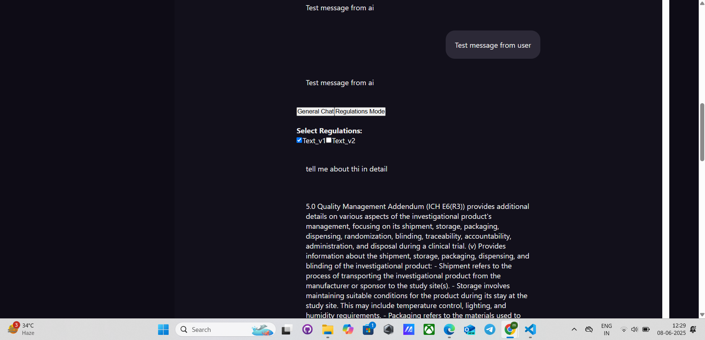

<<<<<<< HEAD
<<<<<<< HEAD
=======
# zipp.ai_case2

>>>>>>> 4fc6336e3550c3506cc661364d3fc18e361c6db9
# 🧠 Local AI Chatbot with RAG (Retrieval-Augmented Generation)

A full-stack AI-powered chatbot built using MERN Stack + LangChain + Ollama + FAISS. This project runs completely **locally** without relying on paid APIs like OpenAI/Gemini. It can understand user questions and retrieve answers from your custom documents using local LLMs.

---

## 🌟 Features

* ✅ Full MERN Stack app (React + Express + MongoDB)
* ✅ AI-powered chat with local LLMs using Ollama
* ✅ RAG: Retrieve answers from your uploaded documents
* ✅ Embeddings using `nomic-embed-text`
* ✅ Local vector store with **FAISS** for fast document similarity search
* ✅ Clerk authentication (for demo purpose)

---

## 🛠️ Tech Stack

### ⚙️ Backend :

* Node.js + Express
* LangChain (for embedding + retrieval)
* FAISS (vector DB)
* Ollama (runs local models like Mistral)
* nomic-embed-text (for document embeddings)

### 🎨 Frontend:

* React.js
* Tailwind CSS  
 

---

## 🧠 Key Concepts

### 🔹 Ollama

Ollama is a tool to run AI models **locally** on your system. It supports models like Mistral, LLaMA, Phi-2, etc.

### 🔹 Mistral

Mistral is a small but powerful open-source LLM. It's used to generate responses in the chat.

### 🔹 Embedding Service

This service reads the uploaded documents and converts them into **vector form** using `nomic-embed-text`, so the model can understand and search through them.

### 🔹 FAISS (Vector Store)

FAISS is used to **store and search document vectors** locally. It's fast and reliable for similarity search.

### 🔹 RAG (Retrieval-Augmented Generation)

Instead of answering from memory, the LLM retrieves relevant documents first, then uses them to generate accurate answers.

---
## code structure in newprompt.jsx

text
START
  │
  ├── User selects mode:
  │   ├── General Mode ➔ Normal chat
  │   └── Regulations Mode ➔ Show document list
  │
  ├── User can:
  │   ├── Upload image (General Mode)
  │   ├── Select documents (Regulations Mode)
  │   └── Type question
  │
  ├── When user sends message:
  │   ├── If General Mode:
  │   │   └── Send to general chat API
  │   ├── If Regulations Mode:
  │   │   └── Send to regulations API with selected docs
  │
  ├── Show loading spinner
  │
  ├── Get response from API
  │
  └── Display answer with sources (if any)

## 🗂️ Folder Structure

```
📦 chatgpt-clone
├── frontend
│   ├── src
│   │   ├── lib
│   │   │   └── Ollama.js  <-- Handles frontend requests to backend
│   │   └── ...
│   └── ...
├── backend
│   ├── embeddingService.js  <-- Embeds and stores documents in FAISS
│   ├── index.js            <-- Main Express server
│   ├── routes
│   ├── 
│   └── ...
```

---

## 🚀 Getting Started

### 1. Install Ollama

Download and install Ollama: [https://ollama.com/download](https://ollama.com/download)

Then run your models:

```bash
ollama run mistral
ollama run nomic-embed-text
```
//backend is in backend folder
### 2. Backend Setup

```bash
cd backend
npm install

# Set environment variables (optional for FAISS)
node embeddingService.js  # This will embed your docs and create FAISS index
npm start            # Start the backend server
```

### 3. Frontend Setup

//frontend is just inside the folder 

```bash
 
npm install
npm run dev
```

---

## 📄 How It Works

1. You upload documents → Backend embeds them using nomic-embed-text.
2. Embeddings are stored in FAISS vector database.
3. When you ask a question → It converts your query into vector form.
4. Finds the most relevant docs from FAISS.
5. Sends docs to Mistral model via Ollama.
6. Mistral responds using both your query and the context from docs.


In my newprompt.js type base search is happening which when click to general chat gives general question answer and when you click to regulation mode the it shows two text_v1 and text_v2 button when you clock them it will give you only related info to them 

---

 

---

## 📸 Screenshots



---

## 📃 License

This project is open-source and free to use for learning and research.

---

## 🙋‍♂️ Author

Made by Gurmeet Singh Rathor
=======
# zipp_ai_task
>>>>>>> 2a675aa7c3baf99282c37a1413d6beb39923e8c9
